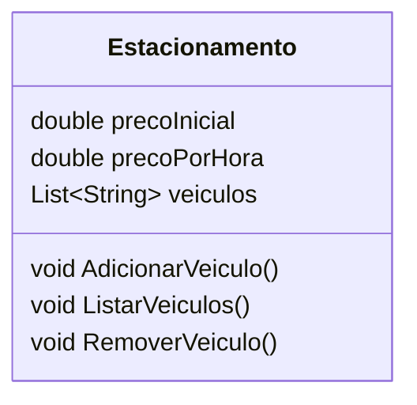

# DIO - BOOTCAMP End to End Engineer (.NET/C#)
> BootCamp realizado na DIO - Digital Innovation One  
> GABRIEL GALACCI MALDONADO  
> MAIO DE 2025

## Desafio de Projeto - Fundamentos de .NET/C#: Estacionamento
> Projeto de um Sistema de Estacionamento para ser feito utilizando conhecimento de fundamentos utilizando a Plataforma .NET e a Linguagem de Programação C#.

## Diagrama da Classe do Projeto Utilizando a Sintaxe Mermaid
